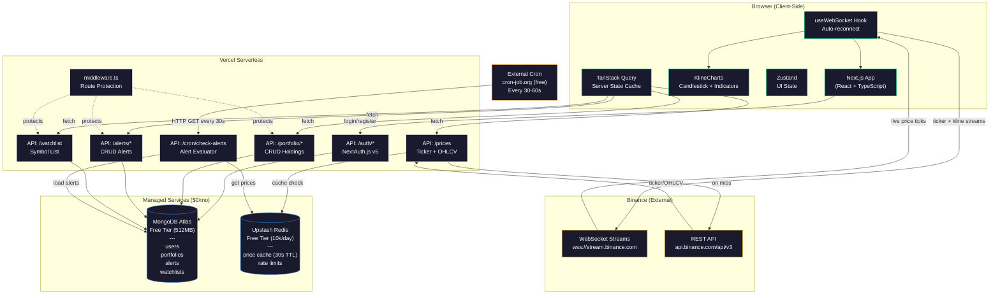
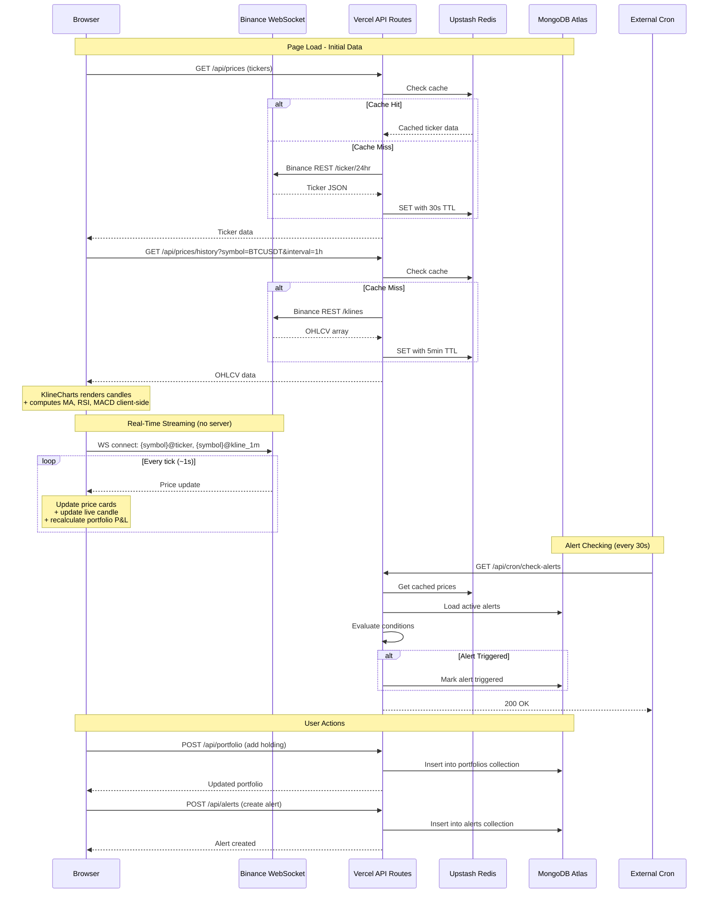
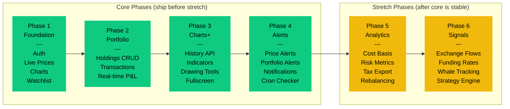

# Crypto Portfolio Tracker - Rebuild Plan

## System Architecture

## Data Flow

## Phase Roadmap

## Component Architecture

```mermaid
graph TB
    subgraph Pages ["App Pages"]
        LOGIN["(auth)/login"]
        REG["(auth)/register"]
        DASH["(dashboard)/page<br/>Main Dashboard"]
        PORT_P["(dashboard)/portfolio"]
        ALERT_P["(dashboard)/alerts"]
    end

    subgraph Layout ["Layout Components"]
        SIDEBAR["Sidebar<br/>Nav + Watchlist"]
        HEADER["Header<br/>Search + Notifications"]
        MOBILE["MobileNav<br/>Bottom Tab Bar"]
    end

    subgraph Market ["Market Components"]
        OVERVIEW["MarketOverview<br/>Price Card Grid"]
        PCARD["PriceCard<br/>Symbol + Price + 24h%"]
        TICKER["PriceTicker<br/>Scrolling Tape"]
    end

    subgraph Chart ["Chart Components"]
        TCHART["TradingChart<br/>KlineCharts Wrapper"]
        SYM_SEL["SymbolSelector<br/>Search + Dropdown"]
        INT_SEL["IntervalSelector<br/>1m/5m/1h/4h/1d"]
    end

    subgraph Portfolio ["Portfolio Components"]
        SUMMARY["PortfolioSummary<br/>Total Value + P&L"]
        HOLDINGS["HoldingsList<br/>Table + Allocation"]
        ADD_FORM["AddHoldingForm<br/>Buy/Sell Entry"]
        TX_HIST["TransactionHistory<br/>Per-Holding Log"]
    end

    subgraph Alerts ["Alert Components"]
        AL_LIST["AlertList<br/>Active + Triggered"]
        AL_FORM["CreateAlertForm<br/>Condition Builder"]
    end

    subgraph Hooks ["Custom Hooks"]
        H_WS["useWebSocket<br/>Generic WS + Reconnect"]
        H_BIN["useBinanceStream<br/>Ticker + Kline Streams"]
        H_PORT["usePortfolio<br/>TanStack Query CRUD"]
        H_ALERT["useAlerts<br/>TanStack Query CRUD"]
        H_PRICE["usePrices<br/>TanStack Query + Cache"]
    end

    subgraph Lib ["Server Lib"]
        L_AUTH["auth.ts<br/>NextAuth Config"]
        L_MONGO["mongodb.ts<br/>Mongoose Singleton"]
        L_REDIS["redis.ts<br/>Upstash Client"]
        L_BIN["binance.ts<br/>REST Client"]
    end

    %% Page composition
    DASH --> OVERVIEW
    DASH --> TCHART
    PORT_P --> SUMMARY
    PORT_P --> HOLDINGS
    PORT_P --> ADD_FORM
    PORT_P --> TX_HIST
    ALERT_P --> AL_LIST
    ALERT_P --> AL_FORM

    %% Hook usage
    OVERVIEW --> H_BIN
    TCHART --> H_BIN
    TCHART --> H_PRICE
    SUMMARY --> H_PORT
    SUMMARY --> H_BIN
    HOLDINGS --> H_PORT
    AL_LIST --> H_ALERT

    %% Hook to lib
    H_BIN --> H_WS
    H_PRICE --> L_BIN
    H_PORT --> L_MONGO
    H_ALERT --> L_MONGO

    classDef page fill:#1e293b,stroke:#0ecb81,color:#fff
    classDef comp fill:#1e293b,stroke:#64748b,color:#fff
    classDef hook fill:#1e293b,stroke:#3b82f6,color:#fff
    classDef lib fill:#1e293b,stroke:#f59e0b,color:#fff

    class LOGIN,REG,DASH,PORT_P,ALERT_P page
    class SIDEBAR,HEADER,MOBILE,OVERVIEW,PCARD,TICKER,TCHART,SYM_SEL,INT_SEL,SUMMARY,HOLDINGS,ADD_FORM,TX_HIST,AL_LIST,AL_FORM comp
    class H_WS,H_BIN,H_PORT,H_ALERT,H_PRICE hook
    class L_AUTH,L_MONGO,L_REDIS,L_BIN lib
```

## Rebuild Context

The previous attempt produced 36 source files completing Phase 1, but failed on process:
- Zero commits beyond the initial Create Next App scaffold
- Zero tests (no test framework installed)
- No CI/CD pipeline
- Known bugs: hardcoded Binance URL (403 from US), unused imports, setState-in-effect lint error
- No error boundaries or error states

This rebuild preserves the existing code as reference (`_reference/`, gitignored) and reconstructs
the project feature-by-feature. Every step produces: working code + tests + commit + changelog + session doc.

## Rebuild Approach

1. Move existing `src/`, configs, and docs to `_reference/` (gitignored)
2. Restore working tree to the initial Create Next App state
3. Rebuild incrementally, using `_reference/` as copy-and-improve source
4. Delete `_reference/` after Phase 1 migration is complete

## Process Rules (Every Step)

- Code must build (`npm run build`) and lint (`npm run lint`)
- Unit tests via Vitest (meaningful assertions, no force-pass)
- E2E tests via Playwright where applicable (with Docker MongoDB)
- Conventional commit: `type(scope): description`
- Update `changelogs/CHANGELOG.md` under `[Unreleased]`
- Update `sessions/YYYY-MM-DD-session-NN-handover.md`

## Testing Strategy

| Dependency | Unit Test Mock | E2E Strategy |
|---|---|---|
| Binance REST | `vi.mock` on fetch, JSON fixtures | `page.route()` intercept |
| Binance WebSocket | `MockWebSocket` class in jsdom | `NEXT_PUBLIC_MOCK_WS=true` env flag |
| MongoDB | `mongodb-memory-server` | Docker Compose (real MongoDB) |
| Redis | Mock `@/lib/redis` module | Skip Redis (graceful null fallback) |
| NextAuth | Mock `@/lib/auth` + `next-auth/react` | Real auth against Docker MongoDB |

Fixtures live in `src/__fixtures__/`, mocks in `src/__mocks__/`, E2E in `e2e/`.

## CI/CD Pipeline (`.github/workflows/ci.yml`)

Triggers: push to main, pull requests.
Jobs: lint + type-check, unit tests (Vitest), build, E2E (Playwright + Docker MongoDB).

## Architecture Decisions

**Full-stack Next.js 16** (App Router) -- no separate backend. API Route Handlers for all server logic.

**Direct Binance WebSocket from client** -- public streams require no API key. Client connects to configurable `NEXT_PUBLIC_BINANCE_WS_URL`. Eliminates the entire ingestion worker layer.

**KlineCharts v10** for charting + indicators -- all indicator computation (MA, EMA, BOLL, MACD, RSI, KDJ, etc.) happens client-side via DataLoader pattern. No server-side TA-Lib.

**NextAuth.js v5** for authentication -- email/password + OAuth (Google/GitHub). Stores auth data in the same MongoDB instance.

**MongoDB** for all persistence -- users, portfolios, alerts, watchlists. Flexible schema, no migrations.

**Redis** for three things only: API response caching (30s TTL), alert evaluation state, rate limiting.

**Deployment: Vercel + managed services ($0/mo)** -- MongoDB Atlas free tier (512MB). Upstash Redis free tier (10k commands/day).

**Zustand** for UI state, **TanStack Query** for server state.

## Phase 1: Core Foundation (16 Steps)

### Step 0: Project Infrastructure [CURRENT]
**Scope:** Test framework, CI pipeline, project configs, reference setup.
**Commit:** `chore: scaffold project with Vitest, Playwright, and CI pipeline`

### Step 1: Design System and Theme
**Scope:** globals.css (oklch Binance Pro Dark), root layout (Inter + JetBrains Mono), `cn()` utility, base shadcn/ui components (button, card, input, label, badge, separator).
**Tests:** Unit: `cn()` merges classes; component snapshots for each variant.
**Commit:** `feat(ui): add Binance Pro Dark theme and base shadcn/ui components`

### Step 2: Zustand Store and Types
**Scope:** `uiStore.ts` (selectedSymbol, selectedInterval, sidebar state), `market.ts` types (OHLCV, Ticker24h, Symbol, TickerPrice), `next-auth.d.ts` augmentation.
**Tests:** Unit: store initial state, all actions mutate correctly, subscribe/unsubscribe.
**Commit:** `feat(state): add Zustand UI store and market type definitions`

### Step 3: Database and Cache Clients
**Scope:** `mongodb.ts` (Mongoose singleton), `redis.ts` (Upstash client + `cachedFetch`), `rate-limit.ts` (sliding window).
**Tests:** Unit: cachedFetch (hit/miss/no-redis), rateLimit (allow/deny/no-redis). Integration: connectDB with mongodb-memory-server.
**Commit:** `feat(db): add MongoDB and Redis clients with caching and rate limiting`

### Step 4: Authentication Backend
**Scope:** `auth.ts` (NextAuth v5 config), `models/user.ts`, auth API routes, `middleware.ts`.
**Tests:** Unit: registration validates/rejects/hashes/dedupes, authorize callback, middleware redirects. Integration: full registration with mongodb-memory-server.
**Commit:** `feat(auth): add NextAuth v5 with credentials, OAuth, and route protection`

### Step 5: Authentication UI
**Scope:** Auth layout, login/register pages, providers.tsx.
**Tests:** Unit: form rendering, validation errors, submit calls. E2E: register + login flow.
**Commit:** `feat(auth): add login and registration pages with form validation`

### Step 6: Binance REST API Client
**Scope:** `binance.ts` with configurable `BINANCE_API_URL` env var.
**Tests:** Unit: response parsing, USDT filtering, OHLCV mapping, error handling.
**Commit:** `feat(binance): add configurable Binance REST client with ticker and kline fetchers`

### Step 7: Price API Routes
**Scope:** Ticker and OHLCV API routes with Redis caching and Zod validation.
**Tests:** Unit: cache hit/miss, Zod validation, correct TTL per interval.
**Commit:** `feat(api): add price ticker and OHLCV history API routes with caching`

### Step 8: WebSocket Hooks
**Scope:** Generic WS hook with reconnection, Binance stream hooks.
**Tests:** Unit with MockWebSocket: connect/reconnect/cleanup, ticker/kline transforms.
**Commit:** `feat(ws): add WebSocket hooks with reconnection and Binance stream integration`

### Step 9: Dashboard Layout Shell
**Scope:** Dashboard layout, Sidebar, Header, additional shadcn/ui components.
**Tests:** Unit: sidebar nav, header user info. E2E: sidebar toggle.
**Commit:** `feat(layout): add dashboard shell with collapsible sidebar and responsive header`

### Step 10: Price Data Hooks
**Scope:** TanStack Query hooks for ticker and OHLCV data.
**Tests:** Unit: fetch triggers, refetch interval, error states, cache key structure.
**Commit:** `feat(data): add TanStack Query hooks for ticker and OHLCV data`

### Step 11: Market Overview and Price Cards
**Scope:** PriceCard, MarketOverview with flash animations.
**Tests:** Unit: renders symbol/price/change, bullish/bearish classes, loading skeleton. E2E: dashboard shows price cards.
**Commit:** `feat(market): add live price cards with flash animations and market overview`

### Step 12: Trading Chart
**Scope:** KlineCharts v10 DataLoader integration, timeframes, indicators, drawing tools.
**Tests:** Unit: resize hook, toolbar controls. E2E: chart loads candlesticks.
**Commit:** `feat(chart): add KlineCharts trading chart with indicators and drawing tools`

### Step 13: Watchlist Backend
**Scope:** Watchlist Mongoose model and auth-protected API.
**Tests:** Unit: model defaults, CRUD operations, auth rejection. Integration: with mongodb-memory-server.
**Commit:** `feat(watchlist): add watchlist model and API with auth-protected CRUD`

### Step 14: Watchlist UI
**Scope:** Watchlist query hook with optimistic updates, sidebar component.
**Tests:** Unit: add/remove/optimistic-rollback, renders symbols. E2E: add + remove symbol.
**Commit:** `feat(watchlist): add watchlist sidebar with live prices and symbol management`

### Step 15: Dashboard Integration and Polish
**Scope:** Dashboard page composition, error boundaries, CSP updates.
**Tests:** Unit: page renders, error boundary catches. E2E: full smoke test.
**Commit:** `feat(dashboard): compose dashboard page with error boundaries and integration polish`

## Phase 2: Portfolio Tracking (10 Steps)

### Step 16-25
See detailed plan in `_reference/docs/PLAN.md` or session handover docs.

Steps: Portfolio data model, CRUD API, Transaction API, P&L calculation engine, portfolio dashboard page, transaction form/history, real-time portfolio P&L, performance chart, multi-portfolio support, portfolio phase polish.

## Phase 3: Advanced Charts and Indicators (7 Steps)

### Step 26-32
Enhanced price history API, symbol search, chart type selector, indicator management panel, crosshair/tooltip, fullscreen mode, drawing tools enhancement.

## Phase 4: Alerts System (8 Steps)

### Step 33-40
Alert data model, CRUD API, cron evaluator, notification API, create alert UI, alert management page, in-app notifications, alerts phase polish.

## Known Issues to Fix During Rebuild

1. `binance.ts` -- hardcoded Binance URL (fix: `BINANCE_API_URL` env var, Step 6)
2. `PriceCard.tsx` -- ESLint setState-in-effect error (fix: verify and resolve, Step 11)
3. Unused imports in TradingChart, Sidebar, useBinanceStream, mongodb (fix: clean during migration steps)
4. No error boundaries (fix: add in Step 15)

## Verification Plan

After each step:
1. `npm run lint` -- zero errors
2. `npx tsc --noEmit` -- zero type errors
3. `npm run test` -- all unit tests pass
4. `npm run build` -- clean build
5. E2E tests pass (when applicable, from Step 5 onward)

## Anti-Scope-Creep Rules

1. Each phase ships complete and usable before the next begins
2. No page exists in the sidebar unless it is functional
3. No placeholder components -- if it's in the UI, it works
4. Phases 5-6 do NOT start until Phases 1-4 are deployed to Vercel and stable
