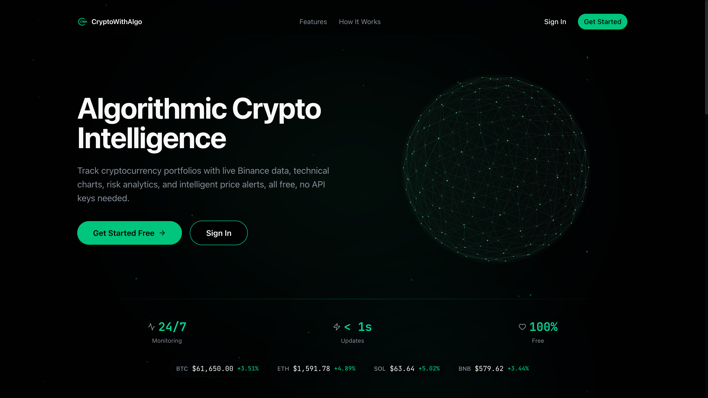

<div align="center">

# CryptoWithAlgo

### Algorithmic Crypto Intelligence

Track cryptocurrency portfolios with live Binance data, interactive technical charts, risk
analytics, a multi-indicator signal engine, strategy backtesting, and intelligent price
alerts. Self-hostable and open source. No exchange API keys required for market data.

[](LICENSE)
[](changelogs/CHANGELOG.md)
[](https://github.com/Smaraputra/crypto-with-algo/actions/workflows/ci.yml)
[](https://nextjs.org)
[](https://www.typescriptlang.org)

[Live Demo](https://cryptowithalgo.com) &middot; [Documentation](docs/TECHNICAL.md) &middot; [Report a Bug](https://github.com/Smaraputra/crypto-with-algo/issues) &middot; [Request a Feature](https://github.com/Smaraputra/crypto-with-algo/issues)

</div>



## Table of Contents

- [About](#about)
- [Features](#features)
- [Built With](#built-with)
- [Quick Start](#quick-start)
- [Configuration](#configuration)
- [Development](#development)
- [Deployment](#deployment)
- [Documentation](#documentation)
- [Contributing](#contributing)
- [Disclaimer](#disclaimer)
- [License](#license)

## About

CryptoWithAlgo is a real-time cryptocurrency portfolio tracker and analysis dashboard built
with Next.js 16. It combines live Binance market data, interactive trading charts, a
multi-indicator signal engine, a strategy backtester, a trading journal, and configurable
price alerts in a single, self-hostable application. It is aimed at traders and developers
who want an all-in-one, open-source alternative to scattered tools, with no exchange API
keys required to view market data.

## Features

- Real-time market data: live prices and updates via Binance WebSocket streams
- Interactive charts: KlineCharts v10 with technical indicators and multiple timeframes
- Portfolio management: holdings, transactions, cost basis, and realized/unrealized P&L
- Trading signals: multi-indicator signal engine with per-strategy differentiation and sentiment input
- Backtesting: test strategies against historical data with position sizing and performance metrics
- Trading journal: log trades with tags, notes, and performance analytics
- Analytics: daily snapshots, risk metrics, and tax reporting (FIFO, LIFO, HIFO)
- Price alerts: configurable, recurring alerts evaluated by a scheduled worker
- Research and sentiment: market research notes, Fear and Greed Index, and a crypto news feed

## Built With

- Framework: Next.js 16 (App Router), React 19, TypeScript
- Authentication: NextAuth.js v5 (credentials and OAuth)
- Database: MongoDB 7 (Mongoose ODM)
- Cache: Redis via ioredis
- State: Zustand (client), TanStack React Query (server)
- Charts: KlineCharts v10
- UI: shadcn/ui (New York style), Tailwind CSS v4
- Validation: Zod v4
- Real-time: Binance WebSocket streams
- Testing: Vitest, Testing Library, and Playwright (270+ unit test files plus end-to-end coverage)

## Quick Start

### Prerequisites

- Node.js 18 or newer
- MongoDB 7 or newer (local or Atlas)
- Redis (local or hosted)

### Installation

```bash
# Clone
git clone https://github.com/Smaraputra/crypto-with-algo.git
cd crypto-with-algo

# Install dependencies
npm install

# Configure environment
cp .env.example .env.local
# Fill in MONGODB_URI, REDIS_URL, NEXTAUTH_SECRET, and (optionally) OAuth credentials

# Start MongoDB and Redis
docker-compose up -d

# Seed a demo account and sample data (optional; set SEED_EMAIL and SEED_PASSWORD first)
npm run seed

# Run the dev server
npm run dev
```

Open [http://localhost:3000](http://localhost:3000). Account sign-up is gated by
`ALLOW_REGISTRATION=true` (disabled by default); enable it to create your first account, or
sign in with the seeded demo account.

## Configuration

The application is configured via environment variables. Copy `.env.example` to `.env.local`
and fill in the values. Key variables:

| Variable | Required | Description |
|---|---|---|
| `MONGODB_URI` | Yes | MongoDB connection string |
| `REDIS_URL` | Yes | Redis connection string (for example `redis://localhost:6379`) |
| `NEXTAUTH_SECRET` | Yes | NextAuth session and JWT secret |
| `NEXTAUTH_URL` | Yes | Base URL of the app |
| `BINANCE_API_URL` | Yes | Binance REST endpoint (configurable for proxy or geo-restrictions) |
| `NEXT_PUBLIC_BINANCE_WS_URL` | Yes | Binance WebSocket endpoint (client-side) |
| `GOOGLE_CLIENT_ID`, `GOOGLE_CLIENT_SECRET` | No | Google OAuth |
| `GITHUB_CLIENT_ID`, `GITHUB_CLIENT_SECRET` | No | GitHub OAuth |
| `CRYPTOPANIC_API_TOKEN` | No | News feed source |
| `CRON_SECRET` | Production | Bearer token for the cron alert and optimization endpoints |
| `ALLOW_REGISTRATION` | No | Set to `true` to enable account sign-up |

<details>
<summary>Full environment variable reference</summary>

See [`.env.example`](.env.example) for the complete, commented list, including SMTP
(MailerSend), Cloudflare Turnstile, seed-script, and Binance Futures variables.

</details>

> Note on Binance: the REST API returns HTTP 403 from some regions, including many US IP
> addresses. If you encounter this, point `BINANCE_API_URL` at a permitted endpoint or proxy.

## Development

```bash
npm run dev           # Start dev server (port 3000)
npm run build         # Production build
npm start             # Start production server
npm run lint          # ESLint
npm run typecheck     # TypeScript type check
npm run test          # Unit tests (Vitest)
npm run test:watch    # Unit tests (watch mode)
npm run test:coverage # Unit tests with coverage
npm run test:e2e      # End-to-end tests (Playwright)
npm run seed          # Seed demo data
```

End-to-end tests require MongoDB running (`docker-compose up -d`).

<details>
<summary>Port configuration (dev, production, E2E)</summary>

The app uses separate ports per environment to avoid conflicts:

| Environment | Port | Variable | Usage |
|---|---|---|---|
| Development | 3000 | `PORT` | `npm run dev` |
| Production | Configurable | `PORT` | `PORT=3002 npm start` |
| E2E tests | 3300 | `TEST_PORT` | `npm run test:e2e` |

On VPS deployments with multiple sites, each app runs on a different internal port and Caddy
routes traffic by domain. E2E tests use an isolated port so they do not collide with a
running dev server. See [VPS-DEPLOYMENT.md](VPS-DEPLOYMENT.md).

</details>

<details>
<summary>Project structure</summary>

```
src/
  app/          Next.js App Router (auth, dashboard, marketing, api)
  components/   React components (ui, chart, journal, backtest, analytics, marketing)
  hooks/        Custom React hooks (WebSocket, market data, queries)
  lib/          Server utilities (models, indicators, backtest, signals, db, auth)
  stores/       Zustand stores
  types/        TypeScript types
  __fixtures__/ Test fixtures
  __mocks__/    Module mocks
e2e/            Playwright end-to-end tests
docker/         Production Docker, Caddy, and cron configuration
```

</details>

## Deployment

| Option | Notes |
|---|---|
| VPS (multi-site) | Caddy reverse proxy with automatic HTTPS, plus PM2. See [VPS-DEPLOYMENT.md](VPS-DEPLOYMENT.md). |
| Docker | `docker-compose up -d` for the full stack (Next.js, MongoDB, Redis). |
| Vercel | `vercel deploy`, with MongoDB and Redis provided as managed services. |

## Documentation

- [PROJECT.md](PROJECT.md): feature and architecture overview
- [docs/TECHNICAL.md](docs/TECHNICAL.md): detailed technical architecture
- [VPS-DEPLOYMENT.md](VPS-DEPLOYMENT.md): VPS multi-site deployment guide
- [changelogs/CHANGELOG.md](changelogs/CHANGELOG.md): version history
- [CONTRIBUTING.md](CONTRIBUTING.md): development workflow and conventions
- [SECURITY.md](SECURITY.md): vulnerability reporting policy

## Contributing

Contributions are welcome. Please read [CONTRIBUTING.md](CONTRIBUTING.md) for local setup,
the required checks (lint, typecheck, test, build, and E2E), and the Conventional Commits
convention. By participating, you agree to the [Code of Conduct](CODE_OF_CONDUCT.md).

## Disclaimer

This is an educational and portfolio project. It is not financial advice. The market data,
signals, backtests, and analytics provided are for informational purposes only and may be
inaccurate, delayed, or incomplete. Cryptocurrency trading carries significant risk. Do your
own research and never trade based solely on this software. The software is provided "as is",
without warranty of any kind; the author accepts no liability for any losses incurred.

## License

Distributed under the MIT License. See [LICENSE](LICENSE).

## Acknowledgments

- Binance for market data
- KlineCharts for the charting library
- shadcn/ui for UI components
- Next.js and the React ecosystem
